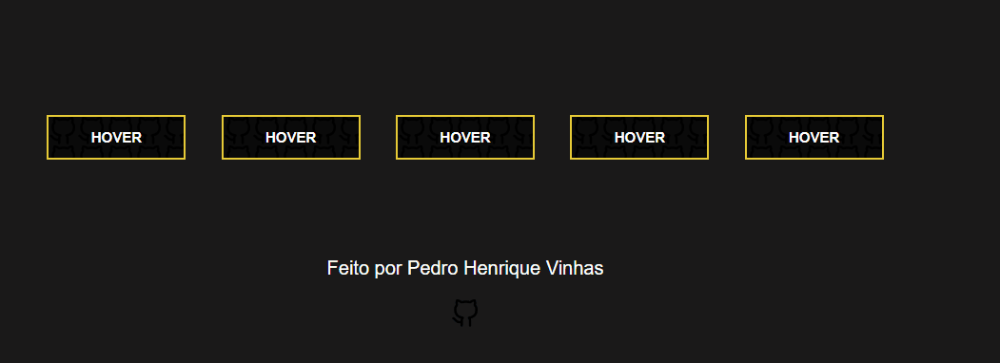

<h1> Front-End Tiny Projects 🤏 </h1>

## Resumo 📄
Esse repositório conterá algumas práticas de projetos e ideias que pesquiso na internet, utilizando principalmente **HTML, CSS ou SaSS e JavaScript.**
O foco principal é aprender a codar as novas tendências modernas de **web-design** que surgirem, e documentar o que foi aprendido em cada conceito.

## Pequenos projetos 🎨

### Button-hover

### Glassmorphism Login Form

